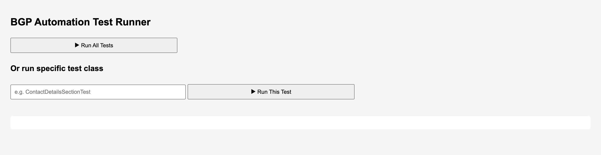

# BGP Automation UI

A minimal Spring Boot web interface to trigger automated Playwright (Java) tests. This is part of the broader [bgp-automation](https://github.com/ekorhenardo/bgp-automation) system.

## Features

- Simple web UI to **trigger all tests** or **specific test classes**
- Integration-ready with test automation project (`bgp-automation`)


## Project Structure

```bash
bgp-automation-ui/
├── src/
│   └── main/
│       ├── java/com/github/ekorhenardo/bgpautomation/ui/
│       │   ├── controller/
│       │   │   └── TestRunnerController.java  ← define REST endpoints
│       │   └── UiApplication.java
│       └── resources/
│           ├── static/
│           │   └── index.html  ← basic UI lives here
│           └── application.properties
├── pom.xml
```

## How to Run the UI

1. Navigate to the UI project folder

```bash
cd bgp-automation-ui
```

2. Run the Spring Boot app

```bash
mvn spring-boot:run
```

3. Open in your browser:

```bash
http://localhost:8080
```

You should see a simple page with two buttons:
1. Run All Tests
2. Run Specific Test (e.g., ContactDetailsSectionTest or EligibilitySectionTest)



Clicking either will trigger Playwright tests via shell commands.

Note: This UI assumes bgp-automation is in a sibling directory and mvn is available in the system path.

## Notes

1. This UI executes shell commands (mvn clean test) directly from the backend.
2. For simplicity, test results are not shown in the UI — only console feedback.

## Related Repositories

- [bgp-automation](https://github.com/ekorhenardo/bgp-automation): Main test framework project using Playwright + JUnit + Allure